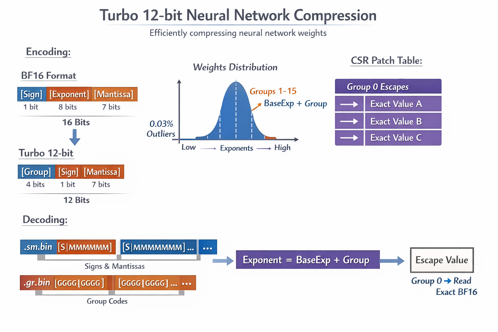
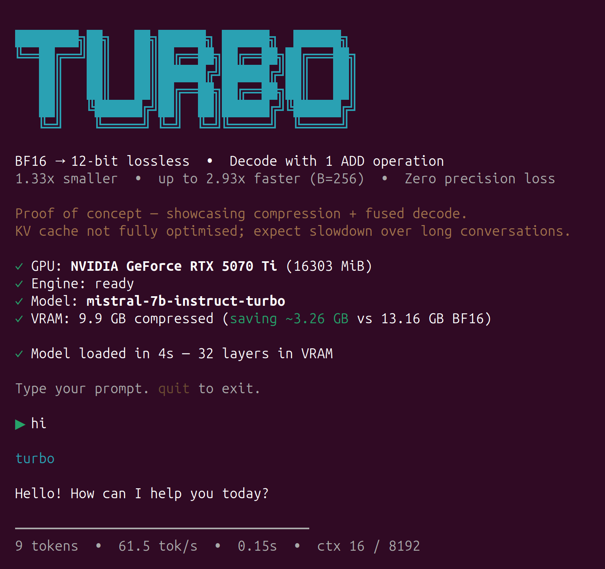

# Turbo Lossless

- **1.33x smaller** -- 12 bits per weight, fixed rate, no entropy coding
- **Up to 2.93x faster than vLLM** -- fused decode + matmul, zero decompression overhead
- **99.97% of weights decode with a single ADD** -- consistent across models, layers, and tensors
- **Zero precision loss** -- 100% bit-perfect, lossless
- **GPU-friendly by design** -- byte-aligned storage, no LUT, no bitstream parsing, near-fixed-length decode that maps directly to GPU-native operations

Lossless BF16 compression that replaces the 8-bit exponent with a 4-bit group code. One integer ADD to decode. Runs on NVIDIA and AMD.

**Byte-aligned split storage: true 12-bit per weight, no 16-bit padding waste, and zero HBM read amplification. Sign + mantissa: exactly 1 byte per element. Group: two nibbles packed into exactly 1 byte.**



> **Note:** Research proof of concept. KV cache and attention are not fully optimised -- expect slowdown over long conversations.



---

## Highlights

- **1.33x compression** -- 12 bits per weight, fixed rate, no entropy coding
- **1 ADD to decode** -- 3-7x fewer ops than other lossless methods
- **2.93x faster** than vLLM at B=256 (Mistral 7B, RTX 5070 Ti)
- **Runs where others OOM** -- Llama 3.1 8B fits in 12.4 GB (vLLM OOMs on 16 GB)
- **NVIDIA + AMD** -- RTX 5070 Ti and MI50 tested

## Quick Start

```bash
# Single prompt
./turbo models/mistral-7b-instruct-turbo "What is the meaning of life?" 200

# Interactive chat
./turbo models/mistral-7b-instruct-turbo -i
```

First run auto-builds the engine. To convert a HuggingFace model:
```bash
./turbo models/mistral-7b-instruct "Hello" 200    # auto-converts to turbo format
```

Set `TURBO_FAST=1` for +10% speed (recommended). See [Technical Details](docs/TECHNICAL.md) for build instructions, environment variables, and benchmarking.

## Results

### Single-User (B=1) -- RTX 5070 Ti

| Model | Turbo tok/s | vs vLLM | vs llama.cpp |
|-------|------------:|--------:|-------------:|
| Llama 2 7B | **64.7** | **1.47x** | 1.09x |
| Mistral 7B | **60.0** | **1.10x** | 1.08x |
| Llama 3.1 8B | **57.0** | vLLM OOM | 1.08x |

### Multi-User B=256 (total tok/s)

| Model | Turbo | vLLM | Speedup |
|-------|------:|-----:|--------:|
| Llama 2 7B | **2,931** | 1,086 | **2.70x** |
| Mistral 7B | **2,554** | 872 | **2.93x** |
| Llama 3.1 8B | **2,471** | OOM | -- |

### Compression (tested across dense, MoE, image, video)

| Model | Params | Escape Rate | Compression |
|-------|-------:|------------:|:-----------:|
| Llama 3.1 405B | 405B | 0.034% | 1.33x |
| Mixtral 8x7B | 46.7B | 0.050% | 1.33x |
| SDXL UNet | 2.6B | 0.233% | 1.33x |
| CogVideoX 2B | 1.7B | 0.128% | 1.33x |

BF16 safetensors only. No GGUF, no FP32, no quantized formats.

---

## Learn More

- **[Technical Details](docs/TECHNICAL.md)** -- encoding format, kernel architecture, full benchmarks, build instructions, file map

## Acknowledgements

The V3 fused decode+GEMM kernel uses tensor core patterns inspired by [ZipServ / ZipGEMM](https://github.com/HPMLL/ZipServ_ASPLOS26) (Fan et al., ASPLOS 2026).
